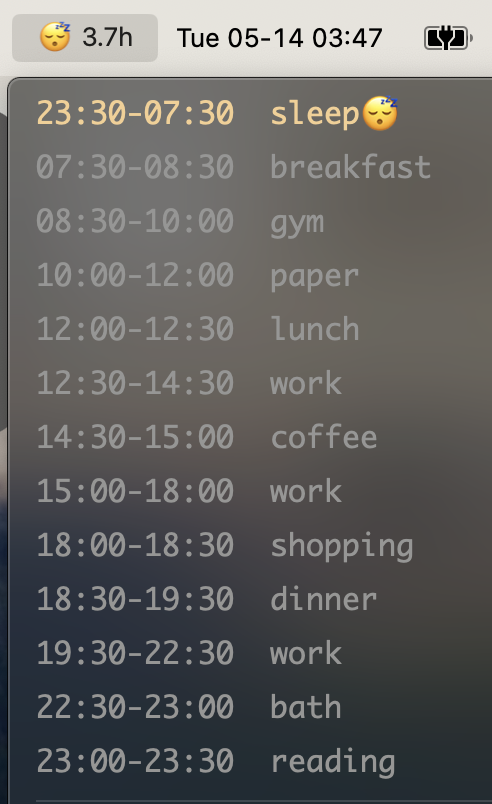
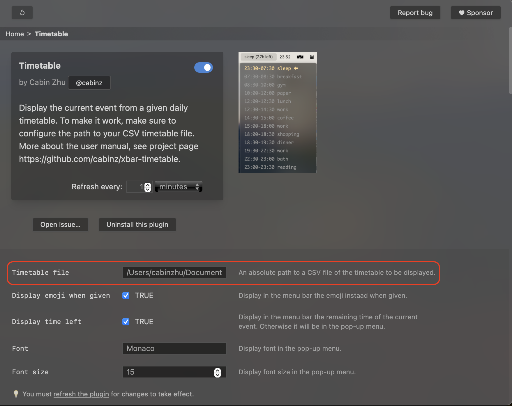

Timetable a plugin for [xbar](https://github.com/matryer/xbar) to quickly show in your macOS menu bar the current event of your daily timetable. Your full timetable will also be displayed in the popped-up menu.



# Requirements

- [xbar](https://github.com/matryer/xbar)

# Configuration

## Install Timetable Plugin

Timetable is now available on the xbar plugin browser to be directly installed.

Or, you could install Timetable from source, by cloning this repo, and copying the script to xbar plugin folder:
```shell
git clone https://github.com/cabinz/xbar-timetable
cp xbar-timetable/timetable.1m.py ~/Library/Application\ Support/xbar/plugins
```

Alternatively, you could create a symbolic link to the script (instead of copying it):

```shell
cd ~/Library/Application\ Support/xbar/plugins
ln -s path/to/timetable.1m.py timetable.1m.py
```

## Customize Your Timetable
Your timetable should be made as a CSV file, where each line is in the format of 
```
<Begin Time>,<End Time>,<Event Name>
```

For example:

```CSV
23:30,07:30,sleep
07:30,08:30,breakfast
08:30,10:00,gym
10:00,12:00,paper
12:00,12:30,lunch
12:30,14:30,work
14:30,15:00,coffee
15:00,18:00,work
18:00,18:30,shopping
18:30,19:30,dinner
19:30,22:30,work
22:30,23:00,bath
23:00,23:30,reading
```

The path to the CSV file needs to be configured in the xbar panel:


Refresh the xbar plugin (by clicking the top-left button) to make the configuration work!

# Contributing

You want to contribute to the project? Welcome!

Since this is an open source project, we would love to have your feedback! If you are interested, we would also love to
have your help! Whether helpful examples to add to the docs, or FAQ entries, everything helps. 