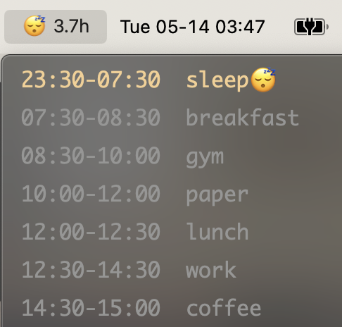

Timetable a plugin for [xbar](https://github.com/matryer/xbar) to quickly show in your macOS menu bar the current event of your daily timetable. Your full timetable will also be displayed in the pop-up menu.



# Requirements

- [xbar](https://github.com/matryer/xbar)

# Configuration

## Install Timetable Plugin

Clone this repo:
```shell
git clone https://github.com/cabinz/xbar-timetable
```

Copy the script from local repo to xbar plugin folder:
```shell
cp xbar-timetable/timetable.1m.py ~/Library/Application\ Support/xbar/plugins
```

Alternatively, you could create a symbolic link to the script (instead of copying it):

```shell
cd ~/Library/Application\ Support/xbar/plugins
ln -s path/to/timetable.1m.py timetable.1m.py
```

## Customize Your Timetable
Your timetable should be made as a CSV file in the line format of 
```
<Begin Time>,<End Time>,<Event Name>,[<Event Emoji>]
```
The column of emoji is optional, i.e. each line of the following CSV text is valid:
```CSV
23:30,07:30,sleep,😴
07:30,08:30,breakfast,
08:30,10:00,gym
```
As default, the emoji will be displayed in the menu bar if given. For more examples of CSV sheets, see [examples](examples/).

The path to the CSV file needs to be configured in the xbar panel:


Besides the file path, there are several more customizable variables could be configured in the panel, including font, font size and emoji / remaining time display.

Refresh the xbar plugin (by clicking the top-left button) to make the configuration work!

# Contributing

You want to contribute to the project? Welcome!

Since this is an open source project, we would love to have your feedback! If you are interested, we would also love to
have your help! Whether helpful examples to add to the docs, or FAQ entries, everything helps. 